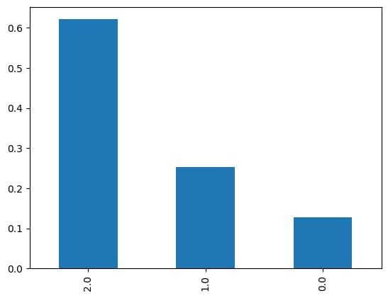
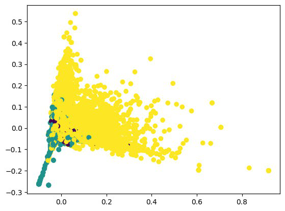

# Описание проекта
## Название проекта: comment-emotionality-classification
### Цель: Определить эмоциональную окраску комментариев пользователей.
### Авторы: Проскурин Глеб Егорович (P4141), Мангараков Александр Дмитриевич (P4141)

Задачи:
1. Анализ существующих решений;
2. Сбор данных;
3. Обучение / дообучение выбранных моделей;
4. Оценка моделей исходя из показателей полученных метрик (`Precision`, `Recall`, `Accuracy`,`F1-score`) на исходном наборе данных;
5. Выбор наиболее оптимальной модели;
6. Развёртывание наилучшей модели.

Датасет: [Youtube Statistics](https://www.kaggle.com/datasets/advaypatil/youtube-statistics)  
Датасет(дополнительный): [Twitter Sentiment Dataset](https://www.kaggle.com/datasets/saurabhshahane/twitter-sentiment-dataset)

Проект: [comment-emotionality-classification](https://github.com/Niruksorp/comment-emotionality-classification)

### Описание датасета и целесообразность его использования:
Youtube Statistics содержит 2 файла, в которых описаны видео и соответствующие им комментарии. 
В контексте решаемой задачи интересен файл с комментариями. 
Содержит 17995 записи, каждой из которых сопоставлена эмоциональная окраска(0,1,2). 
Нулевое значение представляет отрицательное настроение, тогда как значения один и два представляют нейтральное и положительное настроение соответственно.
При необходимости увеличения датасета будет использован Twitter Sentiment Dataset, содержащий 162980 уникальных значений и градацию настроения от -1 до 1. 

### Целесообразность использования датасета:
Для решения поставленной задачи: имея датасет с большим количеством комментариев, распределение которых представлено на (рис 1).

    

Рис.1 Распределение эмоциональных оценок в датасете

Также был использован tfidf для преобразования каждого комментария в векторного пространства с последующей визуализацией (рис 2).

    

Рис.2 tfidf
