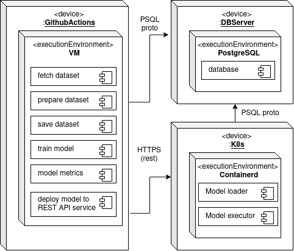
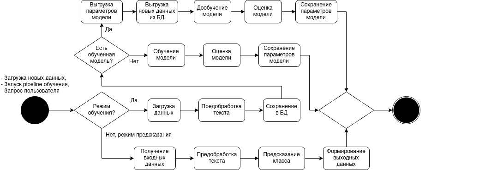

# Система классификации текста статей по категориям
-------------
### Авторы
* Щербаков Виктор Александрович (P4116)

#### Цель 

Автоматизировать процесс поиска новых сотрудников в компанию: увеличить скорость "сканирования" резюме кандидатов за счет автоматической кластеризации поступающих резюме по вакансиям в компании.

#### Задачи
1. Проанализировать существующие решения
2. Загрузка датасета, с возможностью инкрементального добавления данных
3. Первичная обработка данных 
4. Обучение моделей на датасете (или его части)
5. Оценка результатов обучения: метрики `precision`, `recall`, `f1-score` и `accuracy`
6. Оценка времени работы модели
7. Выбор модели с наибольшим соотношением точность/время работы
8. Развёртывание модели

#### Датасет
 [News Category Dataset](https://www.kaggle.com/datasets/rmisra/news-category-dataset)

Пример данных

|index|link|headline|category|short\_description|authors|date|
|---|---|---|---|---|---|---|
|0|https://www\.huffpost\.com/entry/covid-boosters-uptake-us\_n\_632d719ee4b087fae6feaac9|Over 4 Million Americans Roll Up Sleeves For Omicron-Targeted COVID Boosters|U\.S\. NEWS|Health experts said it is too early to predict whether demand would match up with the 171 million doses of the new boosters the U\.S\. ordered for the fall\.|Carla K\. Johnson, AP|2022-09-23 00:00:00|
|1|https://www\.huffpost\.com/entry/american-airlines-passenger-banned-flight-attendant-punch-justice-department\_n\_632e25d3e4b0e247890329fe|American Airlines Flyer Charged, Banned For Life After Punching Flight Attendant On Video|U\.S\. NEWS|He was subdued by passengers and crew when he fled to the back of the aircraft after the confrontation, according to the U\.S\. attorney's office in Los Angeles\.|Mary Papenfuss|2022-09-23 00:00:00|
|2|https://www\.huffpost\.com/entry/funniest-tweets-cats-dogs-september-17-23\_n\_632de332e4b0695c1d81dc02|23 Of The Funniest Tweets About Cats And Dogs This Week \(Sept\. 17-23\)|COMEDY|"Until you have a dog you don't understand what could be eaten\."|Elyse Wanshel|2022-09-23 00:00:00|
|3|https://www\.huffpost\.com/entry/funniest-parenting-tweets\_l\_632d7d15e4b0d12b5403e479|The Funniest Tweets From Parents This Week \(Sept\. 17-23\)|PARENTING|"Accidentally put grown-up toothpaste on my toddler’s toothbrush and he screamed like I was cleaning his teeth with a Carolina Reaper dipped in Tabasco sauce\."|Caroline Bologna|2022-09-23 00:00:00|
|4|https://www\.huffpost\.com/entry/amy-cooper-loses-discrimination-lawsuit-franklin-templeton\_n\_632c6463e4b09d8701bd227e|Woman Who Called Cops On Black Bird-Watcher Loses Lawsuit Against Ex-Employer|U\.S\. NEWS|Amy Cooper accused investment firm Franklin Templeton of unfairly firing her and branding her a racist after video of the Central Park encounter went viral\.|Nina Golgowski|2022-09-22 00:00:00|

Рисунок 1. Распределение статей по категориям

Рисунок 2. Распределение статей по категориям (круговая диаграмма)

#### Целесообразность выбора датасета

Целесообразность использования датасета для решения поставленной задачи: 
- Датасет имеет достаточный объем для обучения модели классификации - 210 тыс. записей.
- Датасет имеет достаточно большое кол-во классов (категорий) - 42.
- Имеется набор категорий с большим кол-вом примеров - 12 категорий имеют >5 тыс. записей.
- Тексты статей представлены в свободной форме, что даёт возможность использования моделей и на других текстах, написанных в произвольной форме.

#### [Ссылка на репозитрий проекта](https://gitlab.90victor09.ru/90victor09/ai-arch)

#### Deployment diagram

#### Activity diagram

