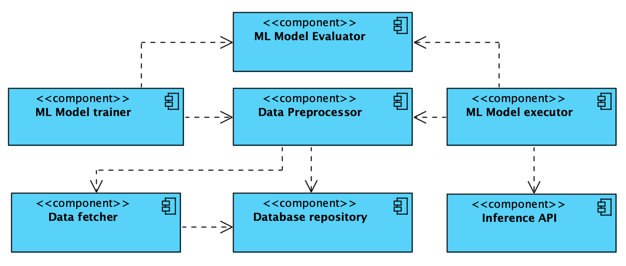

## Проектная работа по дисциплине "Архитектура систем ИИ"
### Автор: Хаяров Э.А. (P4141)
### Тема работы: "Детектирование оскорбителных сообщений на русском языке." 
### Цель работы: создание оптимальной модели, классифицирующей русскоязычные тексты на оскорбительные и неоскорбительные.

Задачи:

1. Анализ существующих решений;
2. Сбор данных;
3. Обучение выбранных моделей;
4. Оценка моделей исходя из показателей полученных метрик: Precision, Recall, Accuracy, F1-score на исходном наборе данных; анализ confusion matrix; будет применена кросс-валидация;
5. Выбор оптимальной модели;
6. Развёртывание оптимальной модели;
7. Оптимизация развёрнутой модели.

Датасет содержит размеченные табличные данные комментариев из 2ch.hk и pikabu.ru. [Ссылка](https://www.kaggle.com/datasets/blackmoon/russian-language-toxic-comments).

Репозиторий проекта: [russian-hate-speech-classifier](https://github.com/EldarKhayarov/russian-hate-speech-classifier)

### Описание датасета
- Объём датасета: 14412 уникальных значений;
- Уместна бинарная классификация, поскольку в датасете представлены два уникальных значения для таргета.
- Количество оскорбительных комментариев равно 4824.
- Количество нейтральных комментариев равно 9588.
- Этот датасет является единственным в своём роде на русском языке, предоставленным в открытом доступе.

### Целесообразность использования выбранного датасета
- Датасет содержит как прямые оскорбления, так и стёб без прямых оскорблений или угроз;
- Нейтральные комментарии можно отличить от оскорбительных.

### Перспективы внедрения решения
Подобные модели могут быть применимы для реализации родительского контроля и "отсева" оскорбительного контента для детей.

### UML диаграммы

Диаграмма развёртывания (Рис. 1)

Диаграмма компонентов процесса работы системы (Рис. 2)

Диаграмма компонентов системы (Рис. 3)
