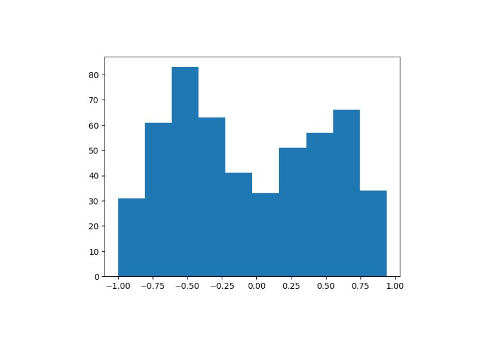

# Проект "Анализ тональности экономических новостей"
-----
### Автор - Вансович Алексей (P4114)

Ссылка на проект - https://github.com/AVU4/stock-news-sentiment-analyzer

#### Цель
Повышение точности анализа тональности экономических новостей.

#### Задачи
1. Сбор данных
2. Спроектировать архитектуру системы
2. Обучить модели на основе обучающей выборки
3. Выполнить оценку моделей на тестовой выборке
4. Выбрать оптимальную модель
5. Развернуть лучшую модель

#### Датасет

Ссылка на источник https://github.com/WebOfRussia/financial-news-sentiment

Пример датасета

| Tittle                                                                   | Score                | Link      | Summary       | Published     | Tickers   |
|--------------------------------------------------------------------------|----------------------| --- | --- | --- | --- |
| Электромобильный стартап Arrival экс-главы Yota уйдет из России          | -0.5833333333333333  | https://www.rbc.ru/technology_and_media/12/05/2022/627c67ed9a7947d6d77cd3c3	| Британский электромобильный стартап Arrival, который основал экс-глава телекоммуникационного оператора Yota и бывший замминистра связи Денис Свердлов, намерен прекратить деятельность в России, сообщает Financial Times. | Thu, 12 May 2022 05:10:01 +0300 | ARVL |
| Экс-глава НМТП рассказал о «напряженных отношениях» братьев Магомедовых  | -0.3142857142857143  | https://www.rbc.ru/society/16/11/2020/5fb2709d9a7947745d46579f | Экс-председатель совета директоров Новороссийского морского торгового порта (НМТП) рассказал в Хамовническом суде о напряженных отношениях между братьями Магомедовыми. В суде рассматривают иск Генпрокуратуры по изъятию $750 млн. | Fri, 20 May 2022 19:13:18 +0300	| NMTP |

Датасет содержит оценку экономической новости от -1 до 1, где -1 - отрицательная новость, 1 - позитивная новость.

